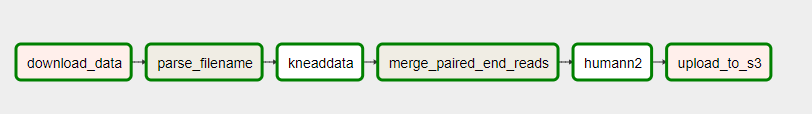

# Final - Airflow

[](https://travis-ci.org/dchen71/2019fa-pset-final-dchen71)
[](https://codeclimate.com/github/dchen71/2019fa-pset-final-dchen71/maintainability)
[](https://codeclimate.com/github/dchen71/2019fa-pset-final-dchen71/test_coverage)

## Introduction
In bioinformatics, our source of big data is comprised of the genetic makeup of animals, humans, bacteria, or any organism that can be sequenced from DNA into machine readable data into interpretable data. Depending on the type of test done on a person, the size of the datasets from a given patient can range from megabytes to gigabytes of data. In a whole experiment combined with many other individuals, a given experiment can potentially generate hundreds of gigabytes and even petabytes of data to process. This puts a strain on most traditional on premise ETL pipelines which relies on the typical and very limited high-performance clusters located on premise. Further compounding this issue, many algorithms are developed from academic institutions and offer varying levels of parallelization and multi-threading support. However, cloud solutions such as Amazon Web Services or Microsoft Azure can allow infinitely scalability of traditional bioinformatics workflows.  

The typical workflow depends on the type of experiment and data. On a high level, a typical workflow involves the processing of raw data sequencing data using various scripts downstream into data that is immediately usable for a bioinformatician. Many academic institutions use various workload managers such as Slurm, PBS, or any other job scheduler for local compute clusters for batch processing jobs. However, there are various issues with such HPC based solutions which renders it hard to use in a modern environment including docker support and many other issues. With the rise of cloud computing comes the rise of many job managers focused in managing cloud based pipelines.    

There are two popular workflow managers for batch processing of jobs currently. Apache Airflow was developed in AirBnB and is the most popular in terms of github stars. Luigi was developed in Spotify and would be a close second for most popular batch job workflow manager. Although both have different architectures, they both perform similar functions as a batch job workflow manager. They are both cloud native solutions which can leverage other technologies such as docker and kubernetes to infinitely scale.  

This repository is a proof of concept of the usability of Apache Airflow in the fields of bioinformatics. The pipeline developered here will be the realtively simple yet obscure metagenomics pipeline in the fields of the microbiome.  

## Methodology

### Apache Airflow
Apache airflow will be used to facilitate batch jobs. Apache Airflow has similar features to Luigi but appears to offer more flexibility to various tasks and functions as well as a nice UI to help visualize pipeline status.  

### Docker
Docker will be used in order to maintain package consistency. Specifically two docker images will be used, one for biobakery/kneaddata which preprocesses metagenomic data by removing human data and biobakery/humann2, which calculates relative abundance of bacterial species in stool samples. It is relatively simple to also setup the connection to pull from Amazon Elastic Container Registry for images to ensure images are not deleted off of dockerhub.  

#### KneadData
[Kneaddata Overview](https://bitbucket.org/biobakery/kneaddata/wiki/Home)  
This algorithm cleans the raw data. This removes any human contaminant data so you should be left with only bacterial or viral data to feed downstream. Although technically this step is optional, it's better to run it to save time and cost and thus a requirement in this use case.  

Note: This requires a database which is not included in this repository to run.  

#### Humann2
[Humann2 Overview](https://bitbucket.org/biobakery/humann2/wiki/Home)  
This algorithm has multiple functions. The first step is to quantify the relative abundance of how much bacteria is in the sample. From there, it calculates how much some of these species contribute to gene familes and metabolic pathway function.  

Note: This requires a large database which is not included in this repository to run.  

### Data
The data used in this project will be derived from the human microbiome project. This will be the raw metagenomic fastq files from fecal data specifically sourced from the Inflammatory Bowel Syndrome study. The raw WGS fastq data can be downloaded [here](https://portal.hmpdacc.org/search/s?filters=%7B%22op%22:%22and%22,%22content%22:%5B%7B%22op%22:%22in%22,%22content%22:%7B%22field%22:%22cases.sample_body_site%22,%22value%22:%5B%22feces%22%5D%7D%7D,%7B%22op%22:%22in%22,%22content%22:%7B%22field%22:%22cases.study_name%22,%22value%22:%5B%22IBDMDB%22%5D%7D%7D,%7B%22op%22:%22in%22,%22content%22:%7B%22field%22:%22files.file_format%22,%22value%22:%5B%22FASTQ%22%5D%7D%7D,%7B%22op%22:%22in%22,%22content%22:%7B%22field%22:%22files.file_type%22,%22value%22:%5B%22wgs_raw_seq_set%22%5D%7D%7D%5D%7D&facetTab=cases) but it is advised to download a few paired end samples for testing as the entire dataset is 2TB. For those not familiar with bioinformatic data in general, on a high level it is collecting DNA from somewhere and analyzing it in a sequencer machine to get raw chunks of DNA sequences. From these chunks of DNA sequences, we align them to a reference to figure out roughly how much of these chunks match a certain species for instance if it comes from a person. From there, there are more algorithms run based on the experiment to get more usable data for the downstream analyst.   

### AWS
This project is cloud focused as the original goal is to develop cloud centric technologies. Although ultimately not implemented, the goal was to set up Airflow with Kubernetes service via AWS EKS. This POC was built on a EC2 shuffling data between S3 in the same region to minimize cost and develop the framework to move towards Kuberentes and docker combined approach.    

## Technical Implementation

**Overview**: This is a POC airflow based pipeline used to analyze metagenomic sequences using the standard kneaddata/humann2 workflow. The high level goal of this POC is to test the feasibility of using airflow to manage and handle batch processing of data in the cloud. The metagenomics pipeline was chosen because it runs one or two algorithms to output relatively small files given the size of the input. Furthermore, metagenomics is a growing field and bioinformaticians will be increasingly using this standard pipeline.  

**Data Description**: The source data lives in a S3 bucket. The source data consists of .fastq or .fastq.gz files sourced from metagenomic experiments. This will not work with 16S experimental data as it is a completely different pipeline.  

**Data Pipeline design**: At a high-level, the pipeline does the following tasks:  

1. Download data from S3  
2. Parse the filename for the 1st file for downstream naming conventions  
3. Run KneadData to preprocess the data from S3  
4. Merge the two target outputs into a single file  
5. Run Humann2 to analyze processed data and get abundance and contribution of each microbial species.  
6. Push the data back into a S3 bucket for later downstream use  



**Design Goals**:
* The dag needs to depend on all elements of the past run  
  * eg. Data needs to download, preprocess, etc  
* Do not need notifications for now  
* Do not need to retry on on failures  

**Pipeline Implementation**:

Apache Airflow follows similar principles as Luigi in that they both are Python frameworks used to programmatically create workflows in DAGs. Airflow automatically creates a master dag and has a framework to help visually represent the flow of data via the web server. A **dag** represents the graph and directionality of how you want your tasks in a workflow to be done. Airflow uses **operators** which represent how those tasks get done.  

A quick overview of the operators and hooks used:  
* `BashOperator`: Runs operations in bash
* `PythonOperator`: Runs operations in python
* `DockerOperator`: Runs tasks through a docker image
* `S3Hook`: Hook to push or pull data from S3

## How to Run

### 01. Initialization steps
```
# Install all of the necessary packages including airflow
pipenv install

# Initialize the airflow directory and sqlite database
pipenv run airflow initdb

# Initialize the webserver
pipenv run airflow webserver

# Initalize the job scheduler
pipenv run airflow scheduler

# Move dags to be recognized by airflow
cp -r pset_final/dags ~/airflow
```

### 02. Initialize the databases for the pipeline
```
# Kneaddata database - ~3.5GB(slow server)
pipenv run kneaddata_database --download human_genome bowtie2 ~/kneaddata

# Humann2 databases - ~6.5GB(slow server)
pipenv run humann2_databases --download chocophlan full ~/humann2
pipenv run humann2_databases --download uniref uniref90_ec_filtered_diamond ~/humann2
```

### 03. (Optional) Configure AWS Hook

In my case, I set my EC2 instance to be in the same security group as my S3 bucket so my installation came default with the AWS credentials. You can either manually create the credentials file or configure it yourself in the connections tab in the web server.

### 04. Run dag
```
pipenv run airflow trigger_dag metagenomics_docker --conf {'read_name1': 'CSM7KOMH_R1.fastq.gz', 'read_name2': 'CSM7KOMH_R2.fastq.gz'}
```


## Future Considerations

* Build more common bioinformatic pipelines using Airflow
* Combine Docker with the kubernetesPodOperator to allow scalibility of this batch processing pipeline
* Rebuild this metagenomics pipeline with dynamic dag to allow cleaner ETL by listing all of the samples in a given dag run per experiment or study
* With how docker works, this can but does not do a true atomic write. By default, it kind of does by creating a temprorarydirectory if the image becomes too big during run. This current implementation of dag directly mounts and writes to the output folder which can be risky for long term production use.
* Switch from local sqllite database into a full fledged RDBMS for concurrency support
* Setup connection to dump data to data warehouse
